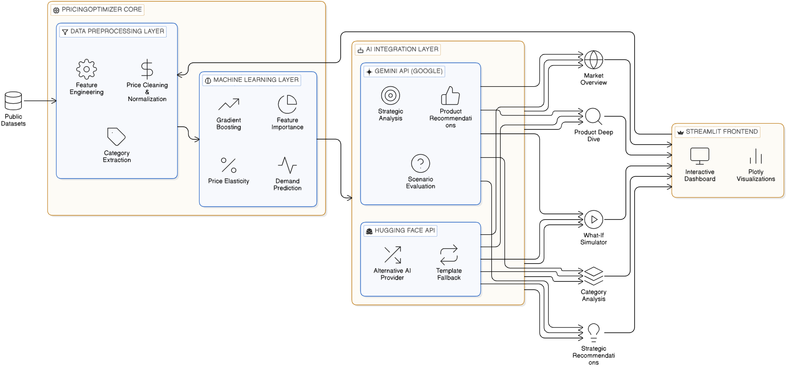

# Pricing-Demand-Exploration

## Overview
The AI-Powered Pricing Strategy & Demand Simulator takes a hybrid approach that combines machine learning's quantitative capabilities with generative AI's qualitative reasoning to solve complex pricing decisions. Rather than treating pricing as a simple formula, we model it as a dynamic system where multiple factors interact to influence demand.

---

## Core Principles

### 1. Data-Driven Decisions
Pricing decisions should be based on empirical evidence, not intuition. By analyzing historical patterns, we can predict how customers will respond to future price changes.

### 2. Quantitative + Qualitative Integration
Numbers tell us what happens, but narrative tells us why and what to do about it. We combine ML predictions with AI-generated insights for complete decision support.

### 3. Risk-Free Experimentation
Businesses should never have to learn about price sensitivity the hard way. Our what-if simulator lets them test scenarios before market implementation.

---

## The Approach

### 1. Dataset
The foundation begins with raw e-commerce data containing product information, prices, discounts, ratings, and descriptions. We transform this messy real-world data into clean, model-ready features.

#### Price Standardization
Raw prices come as strings like `"₹399"` or `"₹1,099"`. We extract the numeric values and convert them to floats for mathematical operations.

#### Percentage Conversion
Discount percentages appear as `"64%"` or `"43%"`. We strip the `%` symbol and convert them to numeric values.

#### Category Extraction
Categories are stored in pipe-separated formats like:

We extract the top-level category for market segmentation.

#### Feature Engineering
From product descriptions, we automatically detect features like braided construction, fast charging support, and warranty inclusion. These become binary indicators that enrich the model.

#### Sentiment Proxy
Customer rating becomes a normalized sentiment score (`rating / 5`), providing a simple but effective measure of customer satisfaction.

---

### 2. Machine Learning
With clean, feature-rich data, we train a **Gradient Boosting Regressor** to predict demand using rating count as a proxy for sales volume.

#### Why Gradient Boosting?
- Captures non-linear relationships (price elasticity isn't linear)
- Automatically learns feature interactions (how price sensitivity changes with rating)
- Provides built-in feature importance for explainability
- Robust to outliers and mixed data types
- Works well with datasets of this size (~500 products)

#### The Prediction Task
The model learns patterns from historical data: given a product's price, discount, rating, features, and category, how many ratings (sales) will it receive? This becomes our demand prediction engine.

#### Key Capabilities

##### Demand Prediction
For any product configuration, we can instantly estimate expected demand. This is the foundation for all simulations.

##### Feature Importance
The model reveals what truly drives demand in your market. Our analysis shows:
- Rating: **38%**
- Price: **24%**
- Sentiment: **15%**

This tells businesses where to focus.

##### Price Elasticity
By systematically varying price while holding other factors constant, we calculate how demand responds to price changes.

Example:
- Elasticity = **-1.8**
- A 1% price increase leads to a 1.8% drop in demand.

##### What-If Simulation
Users can modify any combination of price, rating, or discount and instantly see the predicted demand impact. This enables risk-free experimentation.

---

### 3. Generative AI
Machine learning provides numbers; generative AI provides narrative. We transform quantitative outputs into business-ready strategic insights through careful prompt engineering.

#### Prompt Structure
Each prompt combines three elements:
- **Product / Category Data** – Current metrics and performance
- **ML Outputs** – Predictions, elasticities, feature importances
- **Business Context** – Category averages, benchmarks, percentiles

#### AI Providers
The system supports multiple AI providers with graceful fallback.

##### Google Gemini Pro
Our primary AI provider for high-quality, nuanced analysis. Gemini's strong reasoning capabilities make it ideal for strategic business recommendations.

##### Hugging Face GPT-2
A lightweight, free alternative for basic text generation when Gemini is unavailable or when users prefer open-source options.

##### Template Fallback
When no AI APIs are configured or when API calls fail, rule-based templates ensure the application remains functional.

Products with:
- Rating > 4.3  
- Rating count > 10,000  

automatically receive **"TOP PERFORMER"** recommendations.

---

### 4. Interactive Dashboard
The final layer makes all this power accessible to business users through an intuitive **Streamlit** interface.

#### Market Overview
Executives see high-level metrics and market patterns at a glance.

#### Product Deep Dive
Category managers analyze specific products with full context and AI insights.

#### What-If Simulator
Pricing analysts test strategies before implementation.

#### Category Analysis
Product leaders explore category dynamics and opportunities.

#### Strategic Recommendations
All users get synthesized, actionable insights from AI.

---

## The Integration Synergy
The true power emerges from how these layers work together.

### ML Alone
Provides accurate numbers but no guidance.  
A manager sees *"demand will drop 12%"* but doesn't know whether to proceed.

### AI Alone
Provides plausible text but no data grounding.  
A manager gets a recommendation but can't verify it against reality.

### Together
They create a complete decision support system:

1. User selects a product and scenario  
2. ML instantly calculates predicted demand, elasticity, and benchmarks  
3. This structured data feeds into a carefully crafted prompt  
4. AI generates comprehensive analysis covering:
   - Market position  
   - Optimal strategy  
   - Actionable recommendations  
   - Risks  
   - Monitoring metrics  
5. Dashboard presents both numbers and narrative in an accessible format  

The result is data-grounded, actionable strategic advice that business stakeholders can trust and act upon.

---

## Key Assumptions

### Rating Count Proxies Demand
We assume products with more ratings have sold more units. This is reasonable for e-commerce but not perfect.

### Past Patterns Predict Future
The model assumes historical relationships between price and demand will continue. Major market shifts or new competitors would require retraining.

### Categories Are Meaningful
We assume the provided category hierarchy is relevant for market segmentation. Misclassified products would distort analysis.

### Linear Elasticity Within Range
The model assumes constant elasticity within the tested price range (50–150% of current price). Extreme changes may behave differently.

---

## System Architecture Diagram

  

